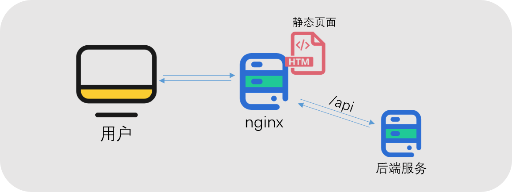

# ConfigManageDemo
读者可以使用该repo来实践16章内容

## 1. 部署指南
### 1.1. Docker部署
* 请参考我们提供的repo：`https://github.com/configmanagedemo/docker.git`

### 1.2. 源码部署
> 当使用源码部署时，我们推荐使用nginx作为反向代理服务，通过nginx代理静态资源文件，并将API请求转发到后端服务处理。  


#### 环境
* 本文使用CentOS7系统
* 本文使用数据库版本：MySQL5.7
#### 步骤
1. 安装Nginx服务
   ```bash
   yum install epel-release -y
   yum install nginx -y
   // systemctl start nginx
   ```
2. 安装MySQL5.7
   ```bash
   yum install https://dev.mysql.com/get/mysql57-community-release-el7-11.noarch.rpm -y
   yum install -y mysql-community-server
   // systemctl start mysqld
   ```
3. 安装Redis
   ```bash
   yum install redis -y 
   // systemctl start redis
   ```
4. 下载前后端源码
   ```bash
   git clone xxx
   ```
5. 配置系统  
   将config-manage-backend目录下的`config.toml.example`重命名为`config.toml`，配置好各项参数。
6. 初始化系统  
   如果是第一运行系统，我们需要初始化数据库。首先确认配置正确，在config-manage-backend根目录执行命令进行初始化，初始化后默认用户admin，密码admin。
   ```bash
   go run cmd/web/main.go ./config.toml init   // 初始化数据库
   ```
7. 运行系统  
   使用命令启动系统
   ```bash
   go run cmd/web/main.go ./config.toml
   ```
8. 配置nginx  
   nginx配置分为两个部分，代理前端的静态资源和转发api请求到后端服务，这里给出一个配置示例。配置完成后重新启动nginx，浏览器访问服务地址即可。
   ```nginx
   server {
    listen       80;
    server_name  localhost;

    #charset koi8-r;
    access_log  /var/log/nginx/host.access.log  main;

    location / {
        root /usr/share/nginx/html/config-manage-frontend/dist;
        index index.html;
    }

    # 
    location ^~ /api/ {
        proxy_pass_header Server;
        proxy_set_header Host $http_host;
        proxy_set_header X-Real-IP $remote_addr;
        proxy_set_header X-Scheme $scheme;
        proxy_set_header Cookie $http_cookie;
        proxy_set_header X_Forward_For $proxy_add_x_forwarded_for;
        proxy_http_version 1.1;
        proxy_set_header Upgrade $http_upgrade;
        proxy_set_header Connection 'upgrade';
        # rewrite ^/api/(.*)$ /$1 break;
        proxy_pass http://localhost:8080;
    }

    #error_page  404              /404.html;

    # redirect server error pages to the static page /50x.html
    #
    error_page   500 502 503 504  /50x.html;
    location = /50x.html {
        root   /usr/share/nginx/html;
    }
   }
   ```

## 2. 系统配置
```toml
title = "Config Manage"

[database]
type="mysql"
host="localhost"
port=3306
username="root"
password=""
name=""

[server]
appKey=""
ip="0.0.0.0"
port=8080
mode="init"
webhook="http://webhookurl"
lruSize=50 # lru缓存量

[redis]
db=0
network="tcp"
address="127.0.0.1:6379"
password=""
```
| 配置字段 | 类型 | 配置内容 |
| -- | -- | -- |
| title | string | 系统名 |
| database.type | string | 数据库类型 |
| database.host | string | 数据库地址 |
| database.port | number | 数据库端口 |
| database.username | string | 数据库用户名 |
| database.password | string | 数据库密码 |
| database.name | string | 数据库名 |
| server.appKey | string | 应用appKey |
| server.ip | string | 服务监听IP |
| server.port | number | 服务监听端口 |
| server.mode | string | 服务启动类型 |
| server.webhook | string | webhook通知地址 |
| server.lruSize | int | 缓存.b文件数量 |
| redis.db | number | redis库 |
| redis.network | string | redis通信方式 |
| redis.address | string | redis地址 |
| redis.address | string | redis访问密码 |
*appKey：配置管理系统使用appKey拼接密码后进行md5，建议设置64位以上*

## 3. 使用示例

### 用户指引  

* 本指引使用Windows10 64位系统
* 本指引使用前文中的`example.xlsm`为配置示例

1. 编写配置&转换配置  

用户使用配套转表工具将Excel配置文件转为.b文件，流程如图所示


将`https://github.com/configmanagedemo/tool.git`克隆或下载到本地。如果用户是第一次使用转表工具，需要安装python2.7和xlrd库，我们已经在`Tools/Install`目录提供`python-2.7.14.amd64.msi`和`xlrd_Install.bat`两个对应安装文件供用户安装使用。  

将`example.xlsm`配置文件放到`Excels`目录下，双击`TableGen.bat`执行配置转换。转换完成后，在`Output/DotB`目录下生成了对应的二进制文件`example.b`。在`Output/Struct`目录下生成了配置的结构文件`example.tars`，示例中的结构如下所示。  

   ```
   module example
   {
       struct Tshop
       {
           0    optional int        id;        //商品ID
           1    optional string        name;        //商品名称
           2    optional string        icon;        //商品Icon
           3    optional string        items;        //物品ID
           4    optional int        valid_hours;        //限时
           5    optional int        money_type;        //货币类型
           6    optional int        money_present_price;        //货币现价
           7    optional string        money_original_price;        //货币原价
       };
       struct Tinsideshop
       {
           0    optional int        id;        //序号
           1    optional string        name;        //名称
           2    optional int        price;        //价格
           3    optional int        count;        //单次购买数量
       };
       struct TexampleInfo
       {
           0    optional map<int, Tshop>        mapshop;        //
           1    optional map<int, Tinsideshop>        mapinsideshop;        //
       };
   };
   ```

其中`Tshop`和`Tinsideshop`是配置表格中对应的两个sheet的结构，`TexampleInfo`是二进制数据的结构。  

2. 上传配置 
  
登录配置管理平台，初始生成的用户、密码为admin/admin，选择左侧的`配置管理`菜单，点击`上传.b文件`按钮，填写更新内容、选取上传文件进行上传，如图所示  

  

上传后我们可以在列表页和详情页看到配置信息，如图所示  


   

3. 使用配置  
   
我们可以在服务代码里使用以下方法解析结构

```C++
template <typename T>
bool toObj(const char* p, unsigned sz, T& t)
{
   if (p == nullptr)
   {
       return false;
   }
   try
   {
       tars::TarsInputStream<BufferReader> is;
       is.setBuffer(p, sz);
       t.readFrom(is);
       return true;
   }
   catch (const TarsProtoException& e)
   {
       std::string msg = "Parse " + T::className() + " failed: " + e.what();
       EXPLOG(msg);
   }
   return false;
}

void main() 
{
   TexampleInfo stData;
   toObj(&vecBuf[0], vecBuf.size(), stData);    // vecBuf为二进制内容，类型为const vector<char>
}
   
```

## 4. 实践指南
### 4.1. 整体交互流程

读者可以将配置管理平台接入已有的业务系统中。业务系统和配置管理平台交互采用RESTful接口形式，数据交互格式为`"application/json"`。业务系统需要提供一个接口供配置管理平台进行Webhook通知。业务系统需要在收到通知后，调用配置管理平台接口拉取二进制配置文件，并在拉取成功后请求配置管理平台提供的回调接口告知拉取状态。详细接口信息可参考源码目录的README.md文件，交互流程如图所示。  


### 4.2. 配置的版本管理

通过配置管理平台我们可以便捷的查看所有的配置二进制文件列表，同时对应的配置文件详情页面展示了配置文件的历史和操作记录。如图所示是`example.b`文件的详细信息页面，上面卡片展示了已经上传的配置文件和正在使用的情况，我们可以对历史配置文件点击使用按钮进行回滚。

不论是上传配置还是点击使用按钮来回滚某个配置，配置管理平台都会触发产生一个状态为`已触发`的通知任务，并通过webhook通知到我们配置的业务服务地址。业务通过接口拉取文件并校验MD5后，通过HTTP接口通知配置管理平台配置拉取成功，这时我们的任务状态变为`成功`。


### 4.3. 不同环境的配置管理

通常，我们在线上会拥有开发/测试/生产等不同环境，我们建议每个环境独立部署配置管理平台。


接口前端：前端提供了一个web页面供用户访问使用，web页面使用vue编写。管理平台同时为业务服务器回调提供了RESTful接口。  

服务层：服务后端采用go编写，服务层分为以下几个部分

1. 配置系统：负责用户上传配置，查看配置，管理配置，生成配置变更任务；
2. 任务系统：处理配置变更任务，查看任务信息，维护任务状态；
3. 用户系统：管理用户信息，登入登出；
4. 权限系统：管理角色，管理用户权限，配置token权限；
5. 日志系统：记录操作日志，运行日志；
6. 文件系统：管理上传的.b文件；
7. Webhook：与外部系统通信。

存储层：配置管理平台使用MySQL存储一般数据，包括文件二进制数据。使用Redis作为缓存系统，主要用于用户登陆Session维护。